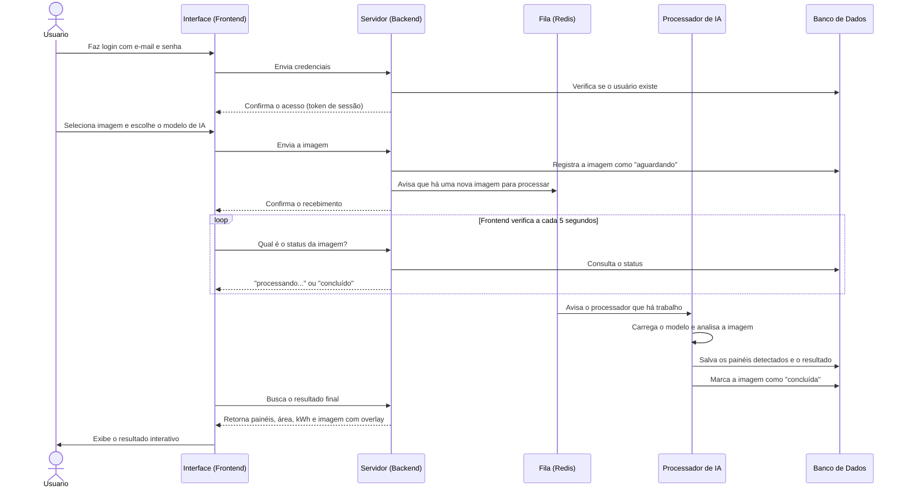
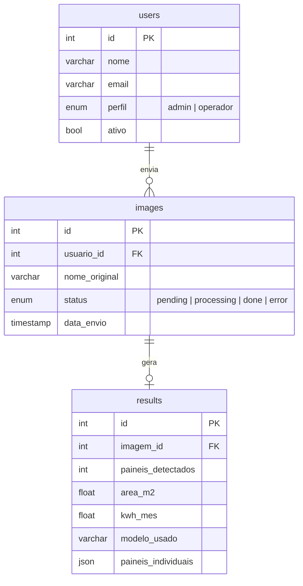
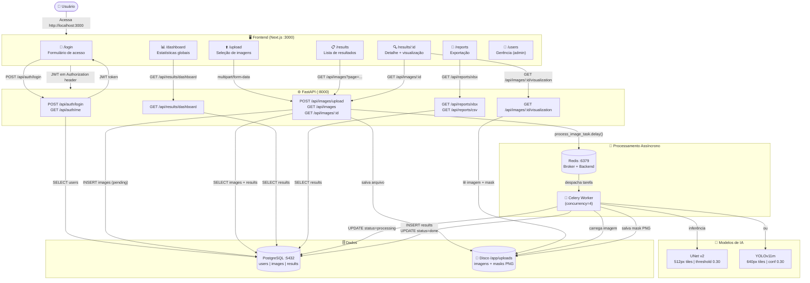

# Documentação Técnica — PrevSolar

> **Projeto:** Residência TIC UEMA BRISAS  
> **Versão da documentação:** Junho de 2026  
> **Stack principal:** FastAPI · PyTorch · UNet/YOLO · Next.js 14 · PostgreSQL · Celery · Redis · Docker

---

## Índice

1. [Objetivo da Aplicação](#1-objetivo-da-aplicação)
2. [Da Pesquisa à Aplicação — Como o Projeto Funciona](#2-da-pesquisa-à-aplicação--como-o-projeto-funciona)
3. [Arquitetura da Aplicação](#3-arquitetura-da-aplicação)
4. [Tecnologias Utilizadas](#4-tecnologias-utilizadas)
5. [Frontend](#5-frontend)
6. [Backend](#6-backend)
7. [Banco de Dados](#7-banco-de-dados)
8. [Redis](#8-redis)
9. [Docker](#9-docker)
10. [Fluxo Completo do Processamento de Imagens](#10-fluxo-completo-do-processamento-de-imagens)
11. [Modelos de IA](#11-modelos-de-ia)
12. [Configurações da Aplicação](#12-configurações-da-aplicação)
13. [Fluxograma Técnico](#13-fluxograma-técnico)

---

## 1. Objetivo da Aplicação

### Problema resolvido

O **PrevSolar** é uma plataforma web de análise automatizada de imagens de satélite de instalações fotovoltaicas. O problema central que resolve é a **identificação manual e trabalhosa de painéis solares** em grandes instalações, uma tarefa que antes exigia inspeção visual humana demorada e sujeita a erros.

A plataforma recebe imagens de satélite (GeoTIFF ou JPEG/PNG) de usinas ou telhados com painéis solares, aplica modelos de segmentação semântica por IA, e entrega:

- Contagem precisa dos painéis detectados.
- Área total ocupada pelos painéis (em m²), calculada usando o GSD real da imagem.
- Estimativa de geração de energia elétrica mensal (kWh/mês), com base em irradiação solar local calibrada para São Luís-MA.
- Mapa visual com overlay da máscara segmentada sobre a imagem original, com cada painel numerado e destacado.
- Exportação dos resultados em XLSX e CSV para uso em relatórios.

### Usuários

| Perfil | Permissões |
|--------|-----------|
| **Administrador** (`admin`) | Upload, visualização, exportação, gestão de usuários (CRUD completo), acesso ao dashboard |
| **Operador** (`operator`) | Upload, visualização dos próprios resultados, exportação de relatórios |

### Fluxo principal de utilização

1. O usuário faz login com e-mail e senha.
2. Na página **Upload**, seleciona uma ou mais imagens de satélite (PNG, JPG, TIFF — até 10 arquivos, máx. 200 MB cada).
3. Escolhe o modelo de IA (UNet v2 ou YOLO v11m), ajusta o threshold de confiança via slider, e opcionalmente informa o GSD manualmente.
4. A imagem é enviada para o backend via multipart/form-data.
5. O backend enfileira o processamento no Celery; a resposta imediata retorna o ID da imagem com status `pending`.
6. O frontend faz polling a cada 5 segundos até o status mudar para `done`.
7. Ao concluir, exibe a imagem com overlay da segmentação, estatísticas (painéis, área, kWh/mês) e tabela clicável de painéis individuais.
8. O usuário pode exportar o resultado em XLSX ou CSV.

### Casos de uso

- **Inspeção de usinas fotovoltaicas** para contagem e mapeamento de painéis.
- **Estimativa de potencial energético** de uma instalação a partir de imagens de satélite.
- **Geração de relatórios técnicos** para engenharia, financiamento ou manutenção.
- **Monitoramento de expansão** de parques solares.

---

## 2. Da Pesquisa à Aplicação — Como o Projeto Funciona

Antes de entender a aplicação web em si, é importante compreender de onde vêm os modelos de IA que ela utiliza e como eles se integram ao sistema.

### O treinamento dos modelos

Para que a IA consiga detectar painéis solares em imagens de satélite, ela precisa primeiro **aprender** a reconhecê-los. Esse processo de aprendizado — chamado de **treinamento** — aconteceu em um ambiente separado, utilizando imagens de satélite anotadas manualmente, ou seja, com os painéis marcados por especialistas para que o modelo soubesse o que deveria identificar.

Duas tecnologias distintas foram utilizadas para treinar os modelos:

**Para o UNet v2:**
A tecnologia de treinamento foi o **PyTorch** (framework de deep learning desenvolvido pelo Meta/Facebook), combinado com a biblioteca **segmentation-models-pytorch**. A arquitetura escolhida foi a **UNet com encoder ResNet34**: o encoder aprende a extrair características visuais das imagens (bordas, texturas, formas características dos painéis), enquanto o decoder reconstrói um mapa pixel a pixel indicando exatamente onde estão os painéis. O resultado do treinamento é um arquivo de pesos salvos com extensão `.pth`.

**Para o YOLO v11m:**
A tecnologia de treinamento foi o framework **Ultralytics**, que implementa a família de modelos YOLO. O YOLO v11m foi treinado para identificar painéis não só por segmentação de pixels, mas também por bounding boxes (retângulos delimitadores) ao redor de cada painel individualmente. O resultado do treinamento é um arquivo de pesos com extensão `.pt`.

### Do modelo treinado à aplicação

Após o treinamento, os arquivos de pesos ficam salvos localmente (`docs/model/`) e são **incorporados à aplicação web** sem nenhuma alteração. Na aplicação, esses modelos não aprendem mais — eles apenas utilizam o conhecimento adquirido durante o treinamento para **fazer predições** em novas imagens enviadas pelos usuários.

Veja como os componentes se conectam:

```
Usuário envia imagem
        ↓
   [Frontend — Next.js]
   Interface que o usuário vê e interage
        ↓ envia a imagem via HTTP
   [Backend — FastAPI]
   Recebe a imagem, valida, salva no disco
   e registra no banco de dados
        ↓ enfileira o processamento
   [Fila — Redis + Celery Worker]
   Carrega o modelo de IA na memória
   e executa a análise da imagem
        ↓ salva os resultados
   [Banco de dados — PostgreSQL]
   Armazena painéis detectados, área,
   kWh estimados e caminho da máscara
        ↓ frontend busca e exibe
   [Frontend — Next.js]
   Mostra a imagem com overlay, estatísticas
   e tabela interativa de painéis
```

Em resumo: o modelo é treinado uma vez por pesquisadores/engenheiros de IA, e depois vive dentro da aplicação servindo qualquer imagem nova que o usuário enviar. O frontend, o backend e o banco de dados trabalham juntos para tornar esse processo acessível e interativo para o usuário final.

---

## 3. Arquitetura da Aplicação

### Visão geral

O PrevSolar é dividido em cinco partes que trabalham juntas:

| Componente | O que faz |
|-----------|-----------|
| **Frontend** | É a interface que o usuário vê no navegador. Permite fazer login, enviar imagens, acompanhar o processamento e visualizar os resultados. |
| **Backend (API)** | É o servidor que recebe as requisições do frontend, valida os dados, salva as imagens no disco e gerencia as informações no banco de dados. |
| **Worker** | É um processo em segundo plano responsável exclusivamente por executar os modelos de IA. Fica aguardando novas imagens e as processa uma a uma. |
| **Banco de dados** | Armazena todos os dados persistentes: usuários cadastrados, imagens enviadas e resultados das análises. |
| **Redis** | Funciona como um sistema de fila: quando o backend recebe uma imagem, ele avisa o Redis, que por sua vez aciona o Worker para processar. |

### Como o sistema funciona passo a passo



---

## 4. Tecnologias Utilizadas

### Backend

| Tecnologia | Versão | Finalidade no projeto |
|-----------|--------|----------------------|
| **Python** | 3.11 | Linguagem principal do backend e dos pipelines de IA |
| **FastAPI** | ~0.111 | Framework web assíncrono; gera automaticamente OpenAPI/Swagger |
| **Uvicorn** | ~0.30 | Servidor ASGI para rodar FastAPI em produção |
| **Pydantic v2** | 2.7 | Validação de dados, schemas de entrada/saída e configuração via `.env` |
| **SQLAlchemy** | 2.0 | ORM para acesso ao PostgreSQL; usa sessões síncronas com pool |
| **Alembic** | ~1.13 | Gerenciador de migrações do banco de dados |
| **psycopg2-binary** | ~2.9 | Driver PostgreSQL para SQLAlchemy |
| **Celery** | 5.4 | Sistema de filas de tarefas para processamento assíncrono de IA |
| **redis-py** | ~5.0 | Cliente Redis (broker e backend do Celery) |
| **python-jose** | ~3.3 | Criação e validação de tokens JWT (HS256) |
| **bcrypt** | ~4.1 | Hash de senhas com salt |
| **PyTorch** | 2.3 (CPU) | Framework de deep learning; executa a inferência UNet |
| **segmentation-models-pytorch (smp)** | ~0.3 | Biblioteca de segmentação semântica; fornece o modelo UNet+ResNet34 |
| **OpenCV (cv2-headless)** | ~4.10 | Processamento de imagem: tiling, contornos, overlay, conversão BGR/RGB |
| **NumPy** | ~1.26 | Operações matriciais no pipeline de inferência |
| **Pillow (PIL)** | ~10.3 | Leitura de GeoTIFFs 16-bit e conversão de modos de cor |
| **rasterio** | ~1.3 | Leitura de metadados GeoTIFF (transformação geoespacial e CRS) |
| **ultralytics** | ~8.2 | Framework YOLOv11 para o pipeline alternativo de detecção |
| **pandas** | ~2.2 | Manipulação de dados para exportação XLSX/CSV |
| **openpyxl** | ~3.1 | Geração de planilhas XLSX com formatação (cores, congelamento) |

### Frontend

| Tecnologia | Versão | Finalidade |
|-----------|--------|-----------|
| **Next.js** | 14.2.3 | Framework React com SSR/SSG; App Router |
| **React** | 18 | Biblioteca de UI |
| **TypeScript** | 5 | Tipagem estática |
| **Tailwind CSS** | 3 | Utilitários CSS para estilização |
| **TanStack Query (React Query)** | 5.40 | Cache e sincronização de estado servidor, polling automático |
| **axios** | 1.7 | Cliente HTTP com interceptors para JWT |
| **react-hook-form** | 7.51 | Gerenciamento de formulários com validação |
| **Zod** | 3.23 | Schema de validação TypeScript |
| **react-dropzone** | 14.2 | Área de drag-and-drop para upload de arquivos |
| **Recharts** | 2.12 | Gráficos (BarChart horizontal no dashboard) |
| **sonner** | 1.5 | Notificações toast |
| **lucide-react** | — | Ícones SVG |
| **@radix-ui/*** | — | Componentes acessíveis (Dialog, Dropdown, Select, Avatar, etc.) |
| **clsx + tailwind-merge** | — | Composição segura de classes Tailwind |

### Infraestrutura

| Tecnologia | Versão | Finalidade |
|-----------|--------|-----------|
| **Docker** | — | Containerização de todos os serviços |
| **Docker Compose** | — | Orquestração local dos 5 containers |
| **PostgreSQL** | 16-alpine | Banco de dados relacional |
| **Redis** | 7-alpine | Broker de mensagens e backend de resultados do Celery |
| **Node.js** | 20-alpine | Runtime para o container do frontend |

---

## 5. Frontend

O frontend é a interface visual da aplicação — aquilo que o usuário acessa no navegador. É construído com **Next.js** (framework React) e oferece um conjunto de telas organizadas para guiar o usuário do login até a visualização dos resultados.

### Páginas da aplicação

| Página | O que o usuário encontra |
|--------|--------------------------|
| **Login** (`/login`) | Formulário de acesso com e-mail e senha |
| **Dashboard** (`/dashboard`) | Visão geral: total de imagens analisadas, painéis detectados, potencial energético e ranking das imagens com maior geração |
| **Upload** (`/upload`) | Área para enviar imagens de satélite, escolher o modelo de IA, ajustar a sensibilidade da detecção e informar o GSD se necessário |
| **Resultados** (`/results`) | Lista de todas as imagens enviadas com status, opções de busca e filtros |
| **Detalhe do resultado** (`/results/[id]`) | Visualização completa: imagem com overlay dos painéis detectados, estatísticas e tabela clicável painel a painel |
| **Relatórios** (`/reports`) | Exportação dos resultados em Excel (XLSX) ou CSV |
| **Usuários** (`/users`) | Gerenciamento de contas — disponível apenas para administradores |

### Funcionalidades de destaque

**Página de Upload:**
- O usuário arrasta ou seleciona as imagens (PNG, JPG ou TIFF, até 10 arquivos de até 200 MB cada).
- Escolhe qual modelo de IA usar: **UNet v2** ou **YOLO v11m**.
- Ajusta a sensibilidade da detecção com um slider. Valores menores detectam mais painéis (inclusive regiões incertas); valores maiores são mais exigentes.
- Pode informar manualmente o GSD (distância em metros que cada pixel representa), útil quando a imagem não possui metadados geográficos.

**Página de Detalhe do Resultado:**
- Exibe a imagem com os painéis detectados destacados em amarelo e numerados.
- O zoom e o deslocamento (pan) permitem examinar a imagem em detalhes.
- A tabela lateral lista cada painel individualmente com sua área em m², estimativa de geração em kWh/mês e nível de confiança da detecção.
- Clicar em um painel na tabela destaca aquele painel na imagem.

**Atualização automática:**
O frontend verifica automaticamente o status do processamento a cada 5 segundos. Enquanto a IA está trabalhando, uma animação de carregamento é exibida. Assim que o processamento termina, o resultado aparece sem que o usuário precise recarregar a página.

---

## 6. Backend

O backend é o servidor da aplicação — ele fica rodando em segundo plano e responde às ações do usuário: validar o login, receber as imagens enviadas, devolver os resultados e gerar os relatórios. É construído em **Python** com o framework **FastAPI**.

### O que o backend faz

**Autenticação e controle de acesso:**
Ao fazer login, o backend verifica as credenciais e emite um token de sessão (chamado JWT). Esse token é como um crachá: o frontend o envia em todas as requisições para provar que o usuário está logado. O backend também distingue entre perfis — administrador e operador — e restringe ações conforme o perfil.

**Recebimento e armazenamento de imagens:**
Quando o usuário envia uma imagem, o backend valida o tipo de arquivo e o tamanho, salva a imagem no disco e registra as informações no banco de dados. Em seguida, envia uma mensagem para a fila (Redis) indicando que há uma nova imagem para ser processada pelo modelo de IA.

**Consulta de resultados:**
O frontend pergunta ao backend periodicamente qual é o status da imagem. Quando o processamento termina, o backend entrega o resultado completo: painéis detectados, área, estimativa de energia e a imagem com o overlay visual.

**Geração do overlay visual:**
O backend combina a imagem original com a máscara gerada pelo modelo de IA. Sobre a imagem, pinta de amarelo as regiões identificadas como painéis, desenha contornos verdes e numera cada painel. Essa imagem processada é entregue ao frontend para exibição.

**Exportação de relatórios:**
O backend gera arquivos Excel (XLSX) e CSV com todos os dados das análises realizadas — tanto de imagens individuais quanto um relatório consolidado de todas.

### Segurança

As senhas dos usuários nunca são armazenadas diretamente — elas são transformadas em um código embaralhado (hash bcrypt) que não pode ser revertido. O token de sessão expira automaticamente após 8 horas, exigindo novo login.

---

## 7. Banco de Dados

O banco de dados é onde todas as informações da aplicação ficam armazenadas de forma permanente. É utilizado o **PostgreSQL**, um dos bancos de dados relacionais mais robustos e amplamente usados no mundo.

### O que é armazenado

O banco possui três tabelas principais, cada uma com uma responsabilidade clara:

**Usuários** — guarda os dados de cada pessoa cadastrada no sistema: nome, e-mail, perfil (administrador ou operador) e a senha de forma segura (não é armazenada em texto claro).

**Imagens** — registra cada imagem enviada pelo usuário: nome do arquivo, data de envio, tamanho e o **status** atual do processamento. O status pode ser:
- `pending` — aguardando na fila para ser processada
- `processing` — sendo analisada pelo modelo de IA neste momento
- `done` — processamento concluído com sucesso
- `error` — ocorreu um erro durante o processamento

**Resultados** — quando o processamento termina, o resultado completo é salvo aqui: quantidade de painéis detectados, área total em m², estimativa de geração em kWh/mês, o modelo de IA utilizado, o GSD aplicado, e os dados individuais de cada painel (posição, área, estimativa de energia e confiança da detecção).

### Relacionamento entre as tabelas



Cada usuário pode enviar várias imagens. Cada imagem gera exatamente um resultado ao ser processada.

---

## 8. Redis

O **Redis** é um serviço de armazenamento em memória que funciona, neste projeto, como um **sistema de fila de tarefas**.

Quando o usuário envia uma imagem, o backend não processa a IA imediatamente — isso bloquearia o servidor e tornaria a aplicação lenta para todos. Em vez disso, o backend "avisa" o Redis que há uma nova imagem aguardando processamento. O Worker (processo dedicado à IA) fica constantemente escutando o Redis e, ao receber esse aviso, pega a imagem e inicia o processamento.

Essa separação é fundamental: o servidor continua respondendo a outros usuários normalmente enquanto a IA trabalha em segundo plano. Sem o Redis, o processamento de uma imagem grande poderia travar o sistema inteiro por minutos.

Em resumo, o Redis garante que:
- O backend responda imediatamente ao usuário, sem esperar o modelo de IA terminar.
- As imagens sejam processadas em ordem, uma a uma (ou em paralelo, com múltiplos Workers).
- Nenhuma imagem seja perdida se o Worker reiniciar — a tarefa continua na fila.

---

## 9. Docker

O **Docker** é a tecnologia que permite executar toda a aplicação com um único comando, independentemente do sistema operacional ou configurações do computador. Em vez de instalar manualmente Python, Node.js, PostgreSQL e Redis separadamente, o Docker cria ambientes isolados chamados **containers** — cada um com tudo que precisa para funcionar.

### Os 5 containers da aplicação

| Container | O que é | O que faz |
|-----------|---------|-----------|
| **postgres** | Banco de dados PostgreSQL | Armazena todos os dados: usuários, imagens, resultados |
| **redis** | Serviço de fila Redis | Recebe avisos de novas imagens e repassa ao Worker |
| **backend** | Servidor Python (FastAPI) | Responde às requisições do frontend, gerencia uploads e consultas |
| **worker** | Processo de IA (Celery) | Fica em segundo plano processando as imagens com os modelos de IA |
| **frontend** | Interface web (Next.js) | Serve as páginas que o usuário acessa no navegador |

### Por que 5 containers?

Cada parte da aplicação tem necessidades diferentes: o frontend precisa de Node.js, o backend precisa de Python com bibliotecas de IA pesadas, o banco precisa do PostgreSQL. Separar em containers garante que cada parte tenha exatamente o que precisa sem conflitos. Além disso, o Worker pode ser escalado independentemente — se houver muitas imagens para processar, basta iniciar mais containers de Worker.

### Como iniciar a aplicação

```bash
docker compose up -d          # inicia todos os containers
docker compose down           # para todos os containers
docker compose logs -f worker # acompanha os logs do processamento de IA
```

---

## 10. Fluxo Completo do Processamento de Imagens

Esta é a seção mais importante da documentação. Cobre todo o pipeline do momento em que o usuário seleciona o arquivo até a exibição do resultado final.

### Visão geral do fluxo

```mermaid
flowchart TD
    A([Usuário seleciona arquivo]) --> B[Frontend: validação local\ntipo + tamanho]
    B --> C[POST /api/images/upload\nmultipart/form-data]
    C --> D[FastAPI: valida tipo MIME\ne tamanho no servidor]
    D --> E[Salva arquivo em disco\n/app/uploads/uuid.ext]
    E --> F[INSERT Image\nstatus = pending]
    F --> G[process_image_task.delay\nimage_id + threshold + model_name + gsd]
    G --> H[Retorna 200 com image_id\nstatus = pending]
    H --> I{Frontend polling\na cada 5s}
    I -->|pending/processing| I
    I -->|done| J[Carrega ResultSchema]

    G --> K[Redis: encaminha ao Worker]
    K --> L[Worker: UPDATE status → processing]
    L --> M[Carrega imagem em\nresolução nativa]
    M --> N{É GeoTIFF?}
    N -->|Sim| O[PIL: abre + converte RGB\nnormaliza 16-bit → uint8]
    N -->|Não| P[OpenCV cv2.imread]
    O --> Q[cv2.cvtColor BGR]
    P --> Q
    Q --> R{GSD override\nfornecido?}
    R -->|Sim| S[Usa gsd_m_px do usuário]
    R -->|Não| T{É GeoTIFF?}
    T -->|Sim| U[rasterio lê transform + CRS\nconverte graus→metros]
    T -->|Não| V[Fallback 0.30 m/px]
    U --> W[GSD calculado]
    S --> W
    V --> W

    W --> X[Pipeline de tiling\ncom overlap]
    X --> Y[Para cada tile:\npreprocess → predict_probs]
    Y --> Z[Acumula prob_acum / count_acum]
    Z --> AA[Aplica threshold\nbinário 0/1]
    AA --> AB[cv2.findContours\nRETE_EXTERNAL]
    AB --> AC[Filtra contornos\nmin 10 px²]
    AC --> AD[Calcula área_m²\n= px² × gsd²]
    AD --> AE[Calcula kWh/mês\npor painel]
    AE --> AF[Extrai centroide\ne bounding box]
    AF --> AG[Calcula confiança média\npix no contorno]
    AG --> AH[Ordena painéis\npor área decrescente]
    AH --> AI[Salva máscara PNG\nem disco]
    AI --> AJ[INSERT Result\n+ painéis JSON]
    AJ --> AK[UPDATE status → done]
    AK --> I
    J --> AL[GET /api/images/id/visualization]
    AL --> AM[Overlay: máscara amarela\n+ contornos verdes\n+ labels numéricos]
    AM --> AN([Usuário vê resultado])
```



### Etapa 1 — Upload e validação

**Frontend (`upload/page.tsx`):**
- O usuário seleciona de 1 a 10 arquivos via `react-dropzone`.
- O formulário coleta: `files[]`, `threshold` (float 0.10–0.90), `model_name` (string), `gsd_m_px` (float opcional).
- Envia via `FormData` com `Content-Type: multipart/form-data`.

**Backend (`routes/images.py` → `POST /upload`):**
1. Lê `MAX_UPLOAD_SIZE_MB` das settings (padrão: 200 MB).
2. Para cada arquivo:
   - Valida extensão/MIME: aceita `image/png`, `image/jpeg`, `image/tiff`.
   - Valida tamanho em bytes.
   - Gera UUID para o nome do arquivo no disco.
   - Salva em `{UPLOAD_DIR}/{uuid}.{ext}`.
   - Cria registro `Image` no PostgreSQL com `status=pending`.
   - Dispara `process_image_task.delay(image_id, threshold, model_name, gsd_m_px)`.
3. Retorna lista de `ImageResponse` com IDs e status.

### Etapa 2 — Fila e despacho (Celery + Redis)

1. A chamada `.delay()` serializa os parâmetros e publica na fila do Redis.
2. O worker Celery consome a mensagem da fila.
3. O worker atualiza o status da imagem para `processing` no PostgreSQL.

### Etapa 3 — Carregamento da imagem

A imagem é aberta em sua **resolução original completa**, sem nenhum redimensionamento. Isso é essencial para que os modelos consigam distinguir painéis individuais com precisão — reduzir a imagem antes da análise poderia fazer painéis pequenos desaparecerem.

Para imagens no formato GeoTIFF (comuns em imagens de satélite), a aplicação usa uma biblioteca especializada que preserva os dados geográficos. Para outros formatos (JPG, PNG), usa o OpenCV.

### Etapa 4 — Cálculo do GSD

O GSD (Ground Sample Distance) é a medida de quantos metros cada pixel da imagem representa no mundo real. Esse valor é essencial para calcular a área dos painéis com precisão.

A aplicação tenta ler o GSD automaticamente a partir dos metadados geográficos da imagem (presentes em GeoTIFFs). Se não conseguir, usa um valor padrão de **0.30 metros por pixel**. O usuário também pode informar o GSD manualmente na tela de upload caso conheça o valor exato da captura.

**Exemplo:** com GSD de 0.30 m/px, um painel típico de 1,6 m × 1 m ocupa cerca de 5 × 3 pixels na imagem.

### Etapa 5 — Divisão em pedaços (Tiling)

Imagens de satélite são muito grandes para serem processadas de uma vez pelo modelo de IA. A solução é dividir a imagem em pedaços menores chamados **tiles**, analisá-los individualmente e depois montar o resultado final.

Para evitar que painéis que ficam na borda entre dois pedaços sejam detectados pela metade, os pedaços se sobrepõem (overlap). O resultado de cada pedaço é combinado por média nas regiões sobrepostas, o que suaviza as bordas automaticamente.

| | UNet v2 | YOLO v11m |
|--|---------|----------|
| Tamanho do pedaço | 512 × 512 px | 640 × 640 px |
| Sobreposição | 300 px | 300 px |

### Etapa 6 — Preparação do pedaço para o modelo

Antes de enviar cada pedaço para o modelo, ele precisa estar no formato exato que o modelo espera: cores normalizadas com os mesmos valores usados durante o treinamento. O modelo UNet v2 usa normalização baseada nas estatísticas do dataset ImageNet, pois seu encoder (ResNet34) foi originalmente treinado nele.

### Etapa 7 — Inferência do modelo

O modelo analisa cada pedaço e gera um mapa de probabilidades: para cada pixel, indica o quão provável é que aquele ponto seja um painel solar. O resultado é uma imagem em escala de cinza onde pixels mais claros representam maior certeza de ser um painel.

### Etapa 8 — Aplicação do limiar de confiança (threshold)

O mapa de probabilidades é convertido em uma máscara binária (painel / não-painel) aplicando o threshold. Pixels com probabilidade acima do threshold são marcados como painel.

**Impacto do threshold:**
- Valor baixo (ex: 0.10) → detecta mais regiões, incluindo algumas incertas (pode gerar falsos positivos).
- Valor alto (ex: 0.80) → só detecta regiões com alta certeza (pode deixar passar painéis sombreados ou parcialmente visíveis).

O valor padrão é **0.30** para ambos os modelos, mas o usuário pode ajustá-lo no upload.

### Etapa 9 — Identificação dos painéis individuais

Com a máscara binária em mãos, o sistema identifica os contornos de cada região marcada como painel e os trata como painéis individuais
```

Para cada contorno:
1. Calcula `area_px = cv2.contourArea(contour)`. Filtra se `area_px < MIN_PANEL_PIXELS (10)`.
2. `area_m2 = area_px × gsd²`.
3. Estima kWh/mês pela fórmula energética.
4. Calcula centroide via momentos (`cv2.moments`).
5. Calcula bounding box (`cv2.boundingRect`).
6. Calcula confiança média: média das probabilidades de `prob_map` sobre os pixels dentro do contorno.
7. Ordena todos os painéis por `area_m2` decrescente e atribui `panel_id = rank` (1 = maior).

### Etapa 10 — Estimativa energética

```python
def _estimate_kwh(area_m2: float) -> float:
    kwh = area_m2 × IRRADIACAO_LOCAL × EFICIENCIA_MEDIA × (1 - PERDAS_SISTEMA) × 30
    return round(kwh, 2)
```

Valores calibrados para **São Luís-MA** (dados INMET):

| Parâmetro | Valor | Fonte |
|-----------|-------|-------|
| `IRRADIACAO_LOCAL` | 5.5 kWh/m²/dia | Média anual INMET São Luís-MA |
| `EFICIENCIA_MEDIA` | 0.18 (18%) | Eficiência típica de painel fotovoltaico comercial |
| `PERDAS_SISTEMA` | 0.14 (14%) | Perdas por cabeamento, inversor, sujeira, temperatura |

**Exemplo:** 10 m² de painéis → `10 × 5.5 × 0.18 × (1-0.14) × 30 = 254.52 kWh/mês`.

### Etapa 11 — Salvamento dos resultados

Ao final do processamento, todos os dados são salvos no banco de dados: quantidade de painéis, área total, estimativa de energia, modelo utilizado, GSD aplicado e os dados individuais de cada painel (posição, área e confiança). O status da imagem é atualizado para "concluído".

Em caso de falha, o sistema registra o erro e tenta reprocessar automaticamente até 3 vezes antes de marcar a imagem como "erro".

### Etapa 12 — Geração do overlay visual

Para exibir os resultados ao usuário, o backend combina a imagem original com a máscara detectada:
- Pinta de amarelo (semi-transparente) as regiões identificadas como painéis.
- Desenha contornos verdes ao redor de cada painel.
- Numera cada painel com um label (#1, #2, ...).
- Adiciona um painel de informações no canto da imagem.

A imagem resultante é entregue ao frontend para exibição interativa.

---

## 11. Modelos de IA

O projeto utiliza **2 modelos** treinados, ambos mapeados para a mesma interface de saída (`PipelineResult`), o que garante que o restante da aplicação (backend, banco de dados e frontend) funcione de forma idêntica independentemente do modelo escolhido.

### Modelo 1 — UNet v2

Modelo de segmentação semântica baseado na arquitetura **UNet** com encoder **ResNet34**. Analisa a imagem pixel por pixel e gera um mapa indicando quais regiões são painéis solares. É mais sensível a bordas e variações sutis de forma, o que o torna eficaz para instalações onde os painéis têm tamanhos e orientações variadas.

| | |
|--|--|
| **Arquivo do modelo** | `docs/model/NewModelUnet.pth` |
| **Sensibilidade padrão** | 0.30 (threshold) |
| **Formato de entrada** | Pedaços de 512 × 512 pixels |

### Modelo 2 — YOLO v11m

Modelo de detecção de objetos da família **YOLO** (You Only Look Once). Além de identificar as regiões dos painéis, ele localiza cada painel individualmente com maior precisão espacial. É especialmente útil quando os painéis são bem definidos e separados uns dos outros.

| | |
|--|--|
| **Arquivo do modelo** | `docs/model/NewModelYolo11m.pt` |
| **Sensibilidade padrão** | 0.30 (confiança mínima) |
| **Formato de entrada** | Pedaços de 640 × 640 pixels |

### Como a troca de modelo funciona

A seleção do modelo é feita pelo usuário diretamente na página de upload. O backend identifica qual modelo foi escolhido e aciona o pipeline correspondente — UNet v2 ou YOLO v11m — sem qualquer mudança no restante do fluxo.

### Carregamento inteligente do modelo

Para evitar recarregar o modelo do disco a cada imagem processada (o que seria muito lento), o Worker mantém o modelo carregado na memória após o primeiro uso. As inferências seguintes são muito mais rápidas pois o modelo já está pronto.

---

---

## 12. Configurações da Aplicação

A aplicação é configurada por um arquivo chamado `.env`, localizado na raiz do projeto. Esse arquivo concentra todas as definições que podem variar de ambiente para ambiente (desenvolvimento, produção, etc.) sem precisar alterar o código.

### Configurações do banco de dados

| Configuração | Valor padrão | Para que serve |
|-------------|-------------|----------------|
| `POSTGRES_USER` | `prevsolar` | Nome do usuário do banco |
| `POSTGRES_PASSWORD` | `prevsolar_secret` | Senha do banco — **deve ser alterada em produção** |
| `POSTGRES_DB` | `prevsolar_db` | Nome do banco de dados |

### Configurações de segurança

| Configuração | Valor padrão | Para que serve |
|-------------|-------------|----------------|
| `SECRET_KEY` | *(valor de exemplo)* | Chave usada para assinar os tokens de sessão — **deve ser gerada de forma segura em produção** |
| `ACCESS_TOKEN_EXPIRE_MINUTES` | `480` | Tempo de expiração da sessão do usuário (8 horas) |

### Configurações de upload

| Configuração | Valor padrão | Para que serve |
|-------------|-------------|----------------|
| `MAX_UPLOAD_SIZE_MB` | `200` | Tamanho máximo permitido por arquivo de imagem |

### Parâmetros da estimativa de energia

Estes são os valores usados no cálculo de geração estimada de energia. São calibrados para São Luís-MA e podem ser ajustados para outras regiões:

| Configuração | Valor padrão | Significado |
|-------------|-------------|-------------|
| `IRRADIACAO_LOCAL` | `5.5` | Média de irradiação solar por dia na região (kWh/m²/dia) |
| `EFICIENCIA_MEDIA` | `0.18` | Eficiência típica de um painel solar comercial (18%) |
| `PERDAS_SISTEMA` | `0.14` | Perdas por cabos, inversor, sujeira e temperatura (14%) |

Com esses valores, a fórmula aplicada é:

> **kWh/mês = área (m²) × 5,5 × 0,18 × (1 - 0,14) × 30 dias**

### Arquivos dos modelos de IA

Os modelos treinados ficam na pasta `docs/model/` e são automaticamente disponibilizados para o backend:

| Modelo | Arquivo |
|--------|---------|
| UNet v2 | `docs/model/NewModelUnet.pth` |
| YOLO v11m | `docs/model/NewModelYolo11m.pt` |

> **Atenção:** esses arquivos não estão no repositório git por serem muito grandes. Precisam ser copiados manualmente para o ambiente de execução.

---

## 13. Fluxograma Técnico

### Fluxo completo da aplicação



### Fluxo resumido de processamento

```
Usuário
  │
  ▼ (HTTPS / HTTP)
Frontend Next.js
  │ axios + JWT
  ▼
FastAPI /api/images/upload
  │ valida tipo/tamanho
  │ salva em /app/uploads
  │ INSERT Image(status=pending)
  ▼
Redis (fila Celery)
  │
  ▼
Celery Worker
  │ UPDATE status→processing
  │
  ├─► _load_image()        ← PIL/OpenCV, resolução nativa
  │
  ├─► _get_gsd()           ← rasterio: GSD real do GeoTIFF
  │
  ├─► _run_tiled_inference()
  │     ├─ Divide em tiles (640×640 ou 512×512)
  │     ├─ Pré-processa: BGR→RGB→float32→normalização ImageNet
  │     ├─ predict_probs() → forward UNet (ou YOLO)
  │     └─ Acumula: prob_acum / count_acum = mapa final
  │
  ├─► (prob_map > threshold) → mask_bin binária
  │
  ├─► cv2.findContours()
  │
  ├─► _extract_panels()
  │     ├─ área_m² = area_px × GSD²
  │     ├─ kWh/mês = área × 5.5 × 0.18 × 0.86 × 30
  │     ├─ centroide, bbox, confiança média
  │     └─ ordena por área (maior = panel_id=1)
  │
  ├─► _save_mask()          ← PNG em /app/uploads
  │
  ├─► INSERT Result(panel_count, area_m², kWh, mask_path, panels[JSON])
  └─► UPDATE Image(status=done)
        │
        ▼
Frontend polling → status=done
  │
  ├─► ResultSchema: painéis, área, kWh
  │
  └─► GET /api/images/:id/visualization
        ├─ Overlay amarelo semi-transparente
        ├─ Contornos verdes
        ├─ Labels #1, #2, ...
        └─ JPEG (max 4000px) → exibido com zoom/pan
```

---

*Documentação gerada em junho de 2026. Para questões sobre o projeto, consulte o README.md ou os notebooks de validação (`test-model-unet.ipynb`, `test-model-unet-v2.ipynb`).*
